#   Hangman
##  [Code documentation](https://miguelpinto.dx.am/docs/hangman-doc-en.pdf)

##  Game rules

* ###  The game
Hangman is a classic word game in which you must guess the secret word one letter at a time.
Each incorrect guess adds another body part to the hangman. When its body is complete you fail that round.

* ### Rules
The player starts with 5 lives. After each failed round you lose a life and the game round. When you have no more lives left the game ends. The end score may then be recorded in the player’s personal highscore or the general Top 5 Leaderboard. Starting another game will then reset all the player resources, lives, and score. The player is able to choose the language and avatar for each game only before the game begins.

* ### Resources
The player can gain or exchange various resources.

* ####  Lives
The player starts each game with 5 lives and loses one for every word not guessed before the hangman has all its body parts. 
Lives are available to buy for diamonds.

* ####  Score
This is the game score and is reset after the user loses all their lives.

The player gains 1 point for every letter guessed. 
The player gains 5 points for 5 letters guessed consecutively. 
The player gains 10 points for 10 letters guessed consecutively. 
The player gains 25 points for 1 word guessed without failing any letter. 
The player gains 50 points for 5 words guessed without failing any letter. 
The player gains 100 points for 10 words guessed without failing any letter. 

* ####  Coins
150 coins allow the player to have 1 letter revealed amongst the ones hidden on the displayed word. 
25 coins can be exchanged for 1 banknote at the Exchange menu.

The player can gain 0 to 10 coins when correctly guessing a letter – the game timer decreases 1 coin from the possible prize every second until the prize is 0. 
The player gains 5 coins for 5 letters guessed consecutively. 
The player gains 10 coins for 10 letters guessed consecutively. 
The player gains 50 coins for 1 word guessed without failing any letter.
 
* ####  Banknotes
10 banknotes allow the player to have 1 of the definitions revealed if any exist. 
10 banknotes can be exchanged for 1 diamond at the Exchange menu.

The player gains 1 banknote for 1 word guessed without failing any letter. 
The player gains 5 banknotes for 5 words guessed consecutively without failing any letter. 
The player gains 10 banknotes for 10 words guessed consecutively without failing any letter.

* ####  Diamonds
2 diamonds allow the player to restore one of the hangman’s body parts effectively buying one extra failed guess. 
3 diamonds can be exchanged for 1 life at the Exchange menu.

The player gains 1 diamond for 10 words guessed consecutively without failing any letter.

* ### Interface

* **Game screen** 
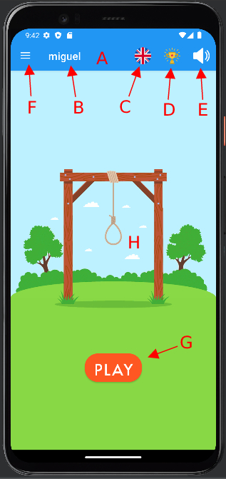

- **A.** The App bar 
User name and a few buttons.

- **B.** User name.

- **C.** Game language. 
The player can change the game language by clicking this button.

- **D.** Highscores. 
The player can see the top 5 scores amongst all players by clicking this button.

- **E.** Highscores. 
The player can mute or unmute the game sound by clicking this button.

- **F.** Menu d'Options. 
The player can open the Options menu hiding on the left by clicking this button.

- **G.** Highscores. 
The player can start a game round by clicking this button.

- **H.** The gallows.

* **Options menu** 
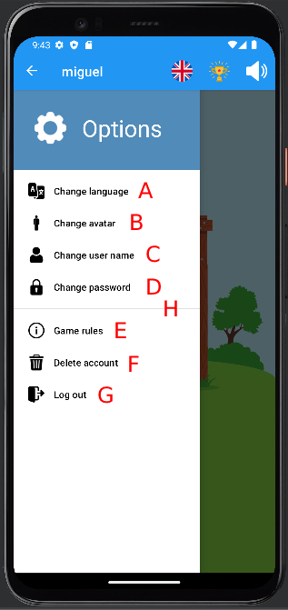

- **A.** The player can change the game language.

- **B.** The player can change their avatar.

- **C.** The player can change their user name.

- **D.** The player can change their password.

- **E.** The player can see the game rules.

- **F.** The player can delete their account.

- **G.** The player can log out.

* **The highscores** 
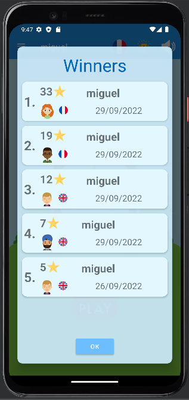

- A list of the 5 top scores amongst all players.

* **The game** 
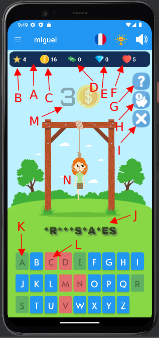

- **A.** The Asset bar. 
These are the player's resources.

- **B.** The score.

- **C.** The coins.

- **D.** The banknotes.

- **E.** The diamonds.

- **F.** The lives.

- **G.** Buying help. 
The player can buy different types of help.

- **H.** Exchange resources. 
The player can exchange their resources.

- **I.** Abandon a game round.

- **J.** The hidden word.

- **K.** A guessed letter.

- **L.** A missed letter.

- **M.** Every elapsed second reduces the potential prize of a guessed letter.

* **Buying help** 
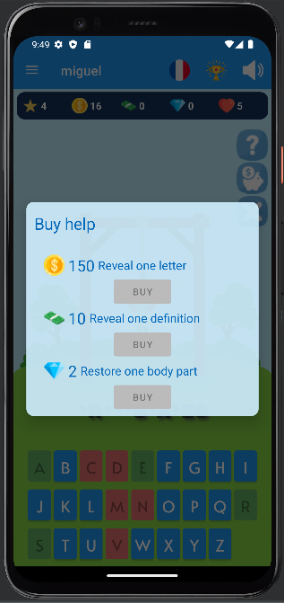

* **Exchange resources** 
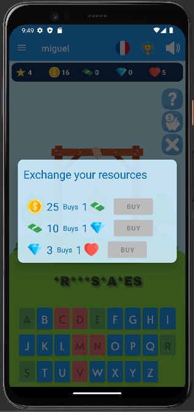

* **Preview - Choose an avatar**             |  * **Preview - Choose a language**
:-------------------------:|:-------------------------:
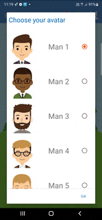  |  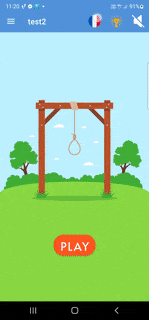

* **Preview - Gameplay** 
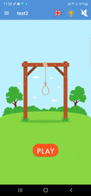

* **Preview - Game rules** 
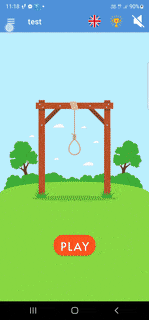

* **Preview - Abandon a game round** 
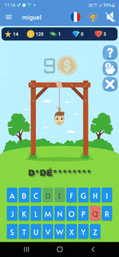

* **Preview - Buy help** 
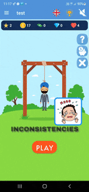

* **Preview - Exchange resources** 
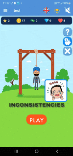

* **Preview - The highscores** 
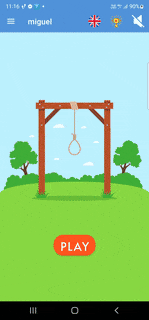

* **Preview - Guess a word** 
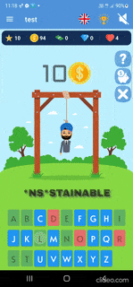

* **Preview - Miss a word** 
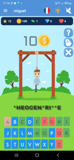
