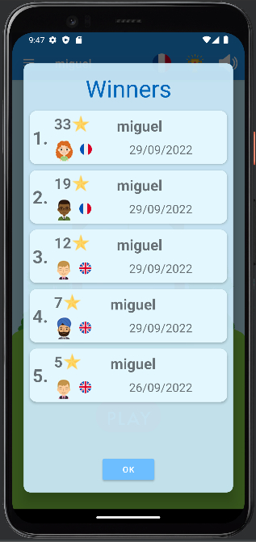
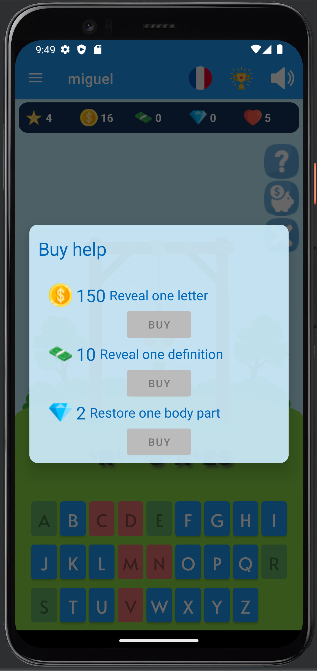

#   Hangman
##  [Documentation du code](https://miguelpinto.dx.am/docs/hangman-doc-fr.pdf)

##  Règles du jeu

* ###  Le jeu
Hangman est un jeu de mots classique dans lequel vous devez deviner le mot secret une lettre à la fois.
Chaque essai incorrect ajoute une nouvelle partie du corps au pendu. Lorsque son corps est complet, vous échouez le tour.

* ### Règles
Le joueur commence avec 5 vies. Après chaque tour raté, vous perdez une vie et le tour de jeu. Lorsque vous n'avez plus de vies, le jeu se termine. Le score final peut ensuite être enregistré dans le meilleur score personnel du joueur ou dans le classement général du Top 5. Commencer une autre partie réinitialisera alors toutes les ressources, les vies et le score du joueur. Le joueur peut choisir la langue et l'avatar pour chaque jeu uniquement avant le début du jeu.

* ### Ressources
Le joueur peut gagner ou échanger diverses ressources.

* ####  Vies
Le joueur commence chaque partie avec 5 vies et en perd une pour chaque mot non deviné avant que le pendu ait toutes ses parties du corps. 
Des vies sont disponibles pour acheter avec des diamants.

* ####  Score
Ceci est le score du jeu et est réinitialisé après que l'utilisateur a perdu toutes ses vies.

Le joueur gagne 1 point pour chaque lettre devinée. 
Le joueur gagne 5 points pour 5 lettres devinées consécutivement. 
Le joueur gagne 10 points pour 10 lettres devinées consécutivement. 
Le joueur gagne 25 points pour 1 mot deviné sans rater aucune lettre. 
Le joueur gagne 50 points pour 5 mots devinés sans rater aucune lettre. 
Le joueur gagne 100 points pour 10 mots devinés sans rater aucune lettre.

* ####  Pièces
150 pièces permettent au joueu r de faire révéler 1 lettre parmi celles cachées sur le mot affiché. 
25 pièces peuvent être échangées contre 1 billet dans le menu Échange.

Le joueur peut gagner de 0 à 10 pièces lorsqu'il devine correctement une lettre - le chronomètre de jeu diminue 1 pièce du prix possible chaque seconde jusqu'à ce que le prix soit 0. 
Le joueur gagne 5 pièces pour 5 lettres devinées consécutivement. 
Le joueur gagne 10 pièces pour 10 lettres devinées consécutivement. 
Le joueur gagne 50 pièces pour 1 mot deviné sans rater aucune lettre.

* ####  Billets
10 billets permettent au joueur de faire révéler 1 des définitions s'il en existe. 
10  billets peuvent être échangés contre 1 diamant dans le menu Échange.

Le joueur gagne 1 billet pour 1 mot deviné sans rater aucune lettre. 
Le joueur gagne 5 billets pour 5 mots devinés consécutivement sans rater aucune lettre. 
Le joueur gagne 10 billets pour 10 mots devinés consécutivement sans rater aucune lettre. 

* ####  Diamants
2 diamants permettent au joueur de restaurer l'une des parties du corps du pendu en lui permettant rater un mot une fois supplémentaire. 
3 diamants peuvent être échangés contre 1 vie dans le menu Échange.

Le joueur gagne 1 diamant pour 10 mots devinés consécutivement sans rater aucune lettre.

* ### Interface

* **Écran de jeu** 

- **A.** L'App bar 
Ici se trouvent le nom de l'utilisateur et des boutons.

- **B.** Nom de l'utilisateur.

- **C.** Langue du jeu. 
Le joueur peut changer la langue du jeu en cliquant sur ce bouton.

- **D.** Highscores. 
Le joueur peut voir les 5 meilleurs scores parmis tous les joueurs en cliquant sur ce bouton.

- **E.** Highscores. 
Le joueur peut activer ou désactiver le son du jeu en cliquant sur ce bouton.

- **F.** Menu d'Options. 
Le joueur peut ouvrir le menu d'Options qui se cache à gauche en cliquant sur ce bouton.

- **G.** Highscores. 
Le joueur peut commencer une partie de jeu en cliquant sur ce bouton.

- **H.** La potence.

* **Menu d'Options** 

- **A.** Le joueur peut changer la langue de jeu.

- **B.** Le joueur peut changer son avatar.

- **C.** Le joueur peut changer son nom d'utilisateur.

- **D.** Le joueur peut changer son mot de passe.

- **E.** Le joueur peut voir les règles du jeu.

- **F.** Le joueur peut supprimer son compte.

- **G.** Le joueur peut se déconnecter.

* **Les highscores** 

- Une liste des 5 meilleurs scores parmis tous les joueurs.

* **Le jeu** 

- **A.** L'Asset bar. 
Ici se trouvent les ressources du joueur.

- **B.** Le score.

- **C.** Les pièces.

- **D.** Les billets.

- **E.** Les diamants.

- **F.** Les vies.

- **G.** Acheter de l'aide. 
Le joueur peut acheter différents types d'aide.

- **H.** Échanhger des ressources. 
Le joueur peut échanger ses ressources.

- **I.** Abandonner la partie de jeu.

- **J.** Le mot caché.

- **K.** Une lettre bien devinée.

- **L.** Une lettre ratée.

- **M.** Chaque seconde qui passe diminue le prix potentiel d'une lettre devinée.

* **Acheter de l'aide** 

* **Échanger des ressources** 

* **Aperçu - Choisir un avatar** 

